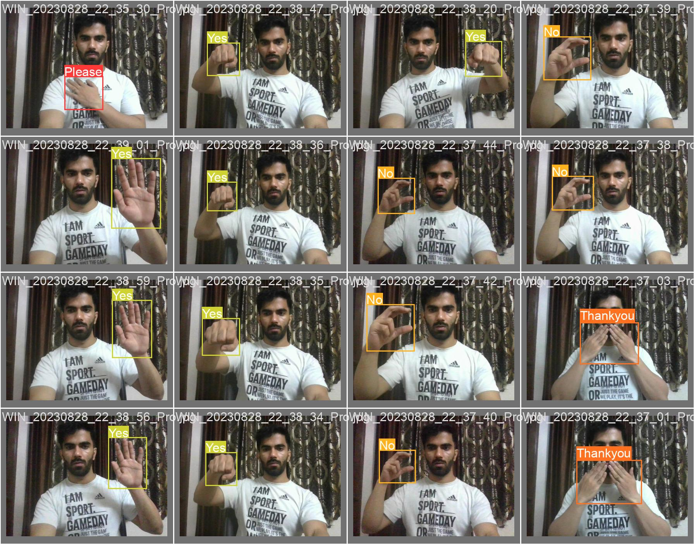
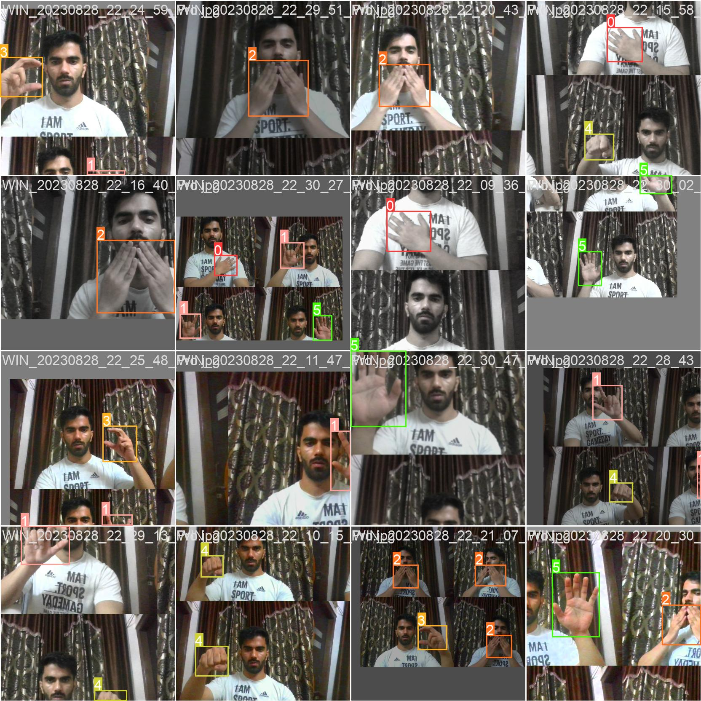

# Project Description: American Sign Language Object Detection using YOLOv5

**How to run this project in your local system**
- first clone the repository in your local system
- go into the local folder where u have cloned the repo
- open the yolov5 folder
- create a virtual enviornment using commat or git bash install the requirement.txt
- And finally run the python run.py
- your system camera will be open

## Project Demo

Check out our project demo video [here]([https://your-video-link](https://drive.google.com/file/d/19kChHkG-DWs2chjnpwEW33ef0zuNANkP/view?usp=sharing)

**Introduction**
The American Sign Language (ASL) Object Detection project using YOLOv5 presents an innovative approach to bridging communication gaps by leveraging computer vision technology. This project centers around developing an accurate and efficient object detection model capable of recognizing and localizing ASL signs for key phrases such as "Hello," "Please," "I love you," "Yes," "No," and "Thank you." The aim is to provide a tool that assists individuals with hearing impairments by translating their sign language gestures into text or speech, enabling smoother interaction with the hearing world.

**Custom Dataset Creation**
To create a robust training dataset, the project initiator collected a diverse set of 120 images. These images feature various hand gestures corresponding to the ASL signs of interest. The images were meticulously annotated using the LabelImg tool, with bounding boxes drawn around each hand gesture. This dataset serves as the foundation for training the YOLOv5 object detection model, allowing it to learn the distinct visual characteristics of each sign. the dataset is provided in the zip format in the given repository

**YOLOv5 Model Training**
The YOLOv5 model, a popular and efficient object detection architecture, was selected for this project. The model was sourced from GitHub and utilized to train on the custom ASL sign dataset. During the training process, the YOLOv5 model learns to identify the six ASL signs by optimizing its parameters based on the annotated bounding boxes. This step is crucial for achieving accurate detection results during inference.

**Testing and Validation**
To assess the effectiveness of the trained YOLOv5 model, a separate test dataset was used. This dataset contained images that were not part of the training process, allowing the project initiator to evaluate the model's generalization capabilities. The test images were fed into the model to determine its accuracy in detecting and localizing the ASL signs accurately. This validation step ensures that the model can perform reliably on unseen data.

**Real-time Application**
Taking the project a step further, the YOLOv5 model was deployed to process real-time video streams from the project initiator's laptop camera. By utilizing the laptop camera, the project demonstrates its practical application in a live setting. This implementation showcases the model's ability to detect ASL signs in real-time, making it a potential tool for facilitating communication between individuals with hearing impairments and those who do not understand sign language.

**Conclusion**
The American Sign Language Object Detection project using YOLOv5 exemplifies the power of computer vision in breaking down communication barriers. By creating a custom dataset, training a YOLOv5 model, and validating its accuracy, this project paves the way for a more inclusive and accessible world. Through real-time application, the project emphasizes the potential of technology to enhance human interaction and understanding across diverse linguistic and sensory backgrounds.
